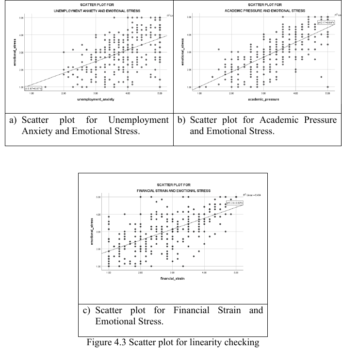

## Emotional Stress and Its Predictors among UiTM Kota Bharu Students
Statistical analysis of emotional stress and its predictors among university students using survey data.

## Overview
This project analyzes emotional stress and its potential predictors among university students using survey data collected from UiTM Kota Bharu students.

## Objectives
-To determine the significant differences in emotional stress among university students between different semesters. 

-To assess the relationship between unemployment anxiety, academic pressure, financial strain and emotional stress among university students. 

-To examine the significant effect of unemployment anxiety, academic pressure and financial strain on emotional stress among university students. 

## Tools
- Microsoft Excel
  
- SPSS

## Statistical Methods
- Descriptive Statistics
  
- Pearson Correlation
  
- One-Way ANOVA
  
- Stepwise Multiple Linear Regression

## Study Context
This study focused on full-time undergraduate students at Universiti Teknologi MARA (UiTM) Kota Bharu. Survey data were collected to examine emotional stress and its potential predictors, including unemployment anxiety, academic pressure, and financial strain.

## Key Findings
The analysis found that academic pressure and financial strain were significant predictors of emotional stress in the final stepwise multiple linear regression model. The final model explained 57.8% of the variance in emotional stress.

## Project Information
**Programme:** Bachelor of Science (Hons.) Statistics  
**University:** Universiti Teknologi MARA (UiTM)  
**Campus:** Kota Bharu, Kelantan

## Data Privacy
The original survey dataset is not publicly shared to protect the privacy and confidentiality of respondents.

## Project Portfolio
[View the Project Portfolio PDF](./Emotional%20Stress%20UiTM%20Portfolio.pdf)

## Key Visual Results

### 1. Linearity Analysis

Scatter plots were used to assess the linear relationships between unemployment anxiety, academic pressure, financial strain, and emotional stress.

### 2. Pearson Correlation Results

All three predictors showed significant positive relationships with emotional stress. Academic pressure had the strongest correlation (**r = 0.702**), followed by financial strain (**r = 0.636**) and unemployment anxiety (**r = 0.505**).

### 3. Stepwise Regression Results

The final model retained **academic pressure** and **financial strain** as significant predictors. The model explained **57.8% of the variance in emotional stress** based on the adjusted R².

[View Regression Results](./Regression%20Results.pdf)
